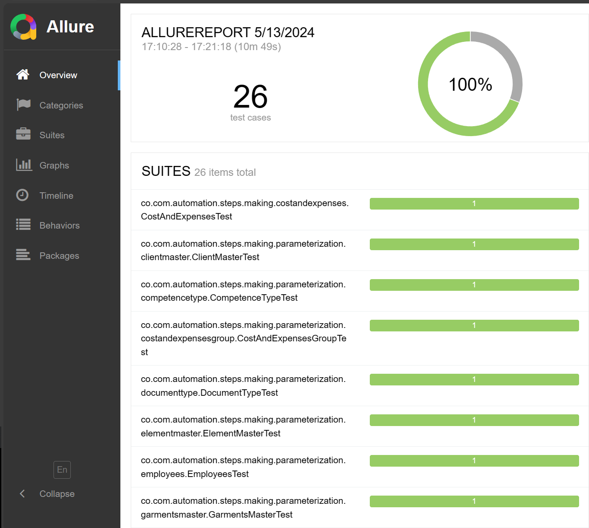

# Automatización - Eress

Este repositorio contiene las pruebas para el módulo de confecciones del aplicativo Eress.

## Prerrequisitos

- [x] Java JDK 17 o superior
- [x] Apache Maven 3.6 o superior para compilar y gestionar las dependencias del proyecto

## Instalación

Para instalar este proyecto en tu máquina local, sigue estos pasos:

1. Clona el repositorio en tu máquina local usando:
    ```sh
    git clone https://github.com/Svandze/Eress-Automation.git
    ```
2. Navega hasta el directorio del proyecto usando:
    ```sh
    cd Eress-Automation
    ```

## Ejecución de las pruebas

Para ejecutar las pruebas, usa el siguiente comando en la raíz del proyecto:

```bash
mvn clean verify
```

## Generar reporte de pruebas
Para generar el reporte de la ejecución debemos ejecutar el comando
```bash
mvn allure:serve     
```


